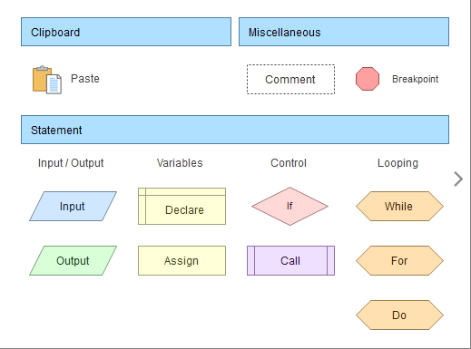
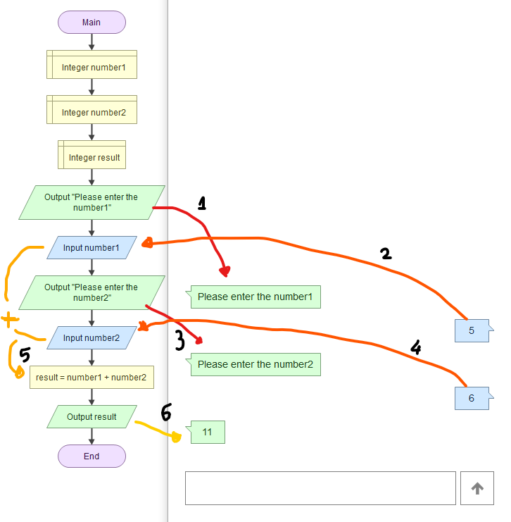

# :zero::one: Introduction Algorithm :bookmark:
## :four: Usage of Algorithms
> Algoritmalar bir problemin çözümü için yazılan adımlardı.
> 
> Algoritmayı 3 farklı şekilde ifade edebiliriz.
>> - Konuşma Dili / Sözel ifade
>> - Sözde kod / Kaba Kod (Pseudocode)
>> - Akış diyagramı (Flowchart)

> **Problem** : Kullanıcıdan alınan iki sayının toplamını ekrana yazan algoritma
> 
>> - Konuşma Dili
>> ```
>> 1. Başla
>> 2. Kullanıcıdan birinci sayının değerini iste
>> 3. Kullanıcıdan ikinci sayının değerini iste
>> 4. Birinci sayının değeri ile ikinci sayının değerini topla
>> 5. Toplama sonucunu ekrana yaz
>> 6. Bitti
>> ```
>> - Sözde Kod / Kaba Kod (Pseudocode)
>> ```pseudocode
>> 1. Begin/Start
>> 2. Input number1
>> 3. Input number2
>> 4. result = number1 + number2
>> 5. Output result
>> 6. End/Stop
>> ```
>> ```pseudocode
>> 1. Begin/Start
>> 2. Define Integer number1
>> 3. Define Integer number2
>> 4. Define Integer result
>> 5. Read number1
>> 6. Read number2
>> 7. result = number1 + number2
>> 8. Write result
>> 9. End/Stop
>> ```
>> - Akış diyagramı (Flowchart)
>>   - Özel olarak ifade edilen akış şekilleri kullanılır.
>> 
>>     
>>   - Problemin çözümü için şekillerin yardımı daha kolay ve sade olur.
>>   - Örnek algoritmanın akış diyagramı
>> 
>>     