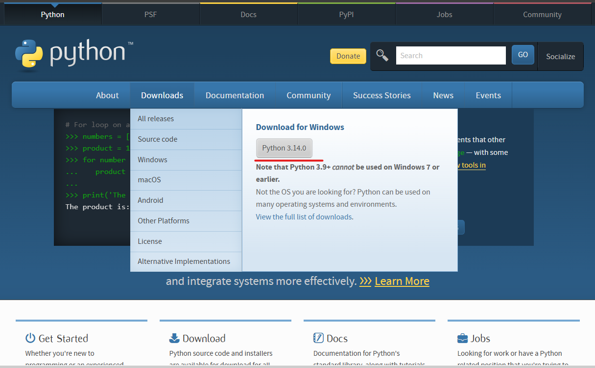
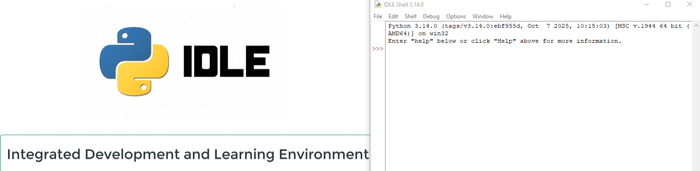
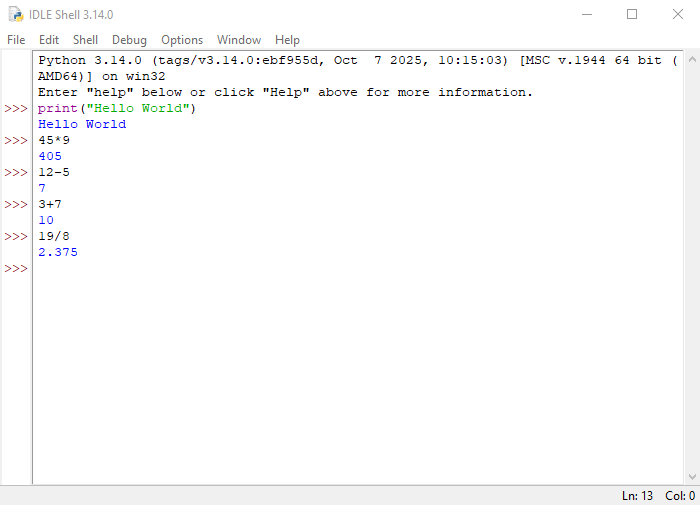

# :zero::two: Computer and Python :bookmark:
## :zero::eight: Installing Python
> ### Description
> Python'u kullanmak için python.org üzerinden uygun sürüm indirilip kurulabilir. Kurulum sırasında "Add Python to PATH" seçeneği işaretlenirse komut satırından Python doğrudan çalıştırılabilir.
> 
> [Download](https://www.python.org/)
> 
> 
> 
> [IDLE]
> 
> 
> [First Commands]
> 